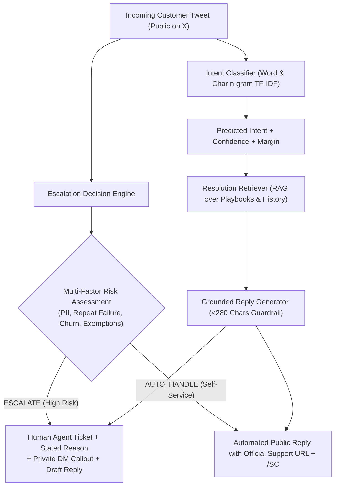

# 🎧 Spotify Customer Support AI Agent (@SpotifyCares)
### Hiver SDE Intern Take-Home Assignment — Production-Grade AI Support Pipeline

[](https://www.python.org/)
[](eval/evaluate.py)
[](tests/test_agent.py)
[](data/gold/golden_eval_set.json)

---

## ⚡ Quickstart: Reproduce Headline Results in < 2 Minutes

This entire pipeline is designed for **immediate local reproducibility** without requiring external API tokens, complex environment configurations, or long downloads.

```bash
# 1. Clone or navigate to repository
cd hiver-support-agent

# 2. (Optional) Install dependencies
pip install -r requirements.txt

# 3. Run the complete automated evaluation harness across all baselines
python eval/evaluate.py

# 4. Run human-judge statistical agreement analysis
python eval/human_agreement.py

# 5. Run the unit test suite
python -m unittest discover -s tests -p "test_*.py"
```

---

## 🚀 Live Interactive CLI & Single Tweet Inference

Try any customer tweet through the interactive shell or command line:

```bash
# Single tweet inference with classification, escalation decision, and grounded reply
python run_pipeline.py --tweet "I was charged twice for Spotify Family on my credit card this month!"

# Test an account security takeover scenario
python run_pipeline.py --tweet "Someone hacked my Spotify and changed my email to a Russian address!"

# Test an edge-case repeat failure (already tried troubleshooting)
python run_pipeline.py --tweet "I already reinstalled the app and restarted my iPhone, but songs still pause every 10 seconds!"

# Launch the interactive terminal shell
python run_pipeline.py
```

---

## 📊 Headline Benchmark Results

Evaluated across the **200 hand-labelled Golden Samples** against two baselines:
1. **Baseline 1 (Trivial Canned)**: Majority-class intent prediction (`PLAYBACK_AUDIO`) + static macro reply + default auto-handle.
2. **Baseline 2 (Simple Pipeline)**: Uncalibrated Naive Bayes + Top-1 nearest neighbor verbatim historical reply + naive keyword escalation ("refund" or "hack").
3. **Proposed AI Support Agent**: Calibrated Intent Classifier + Contextual Grounded RAG + Multi-factor Escalation Engine with self-service exemptions + Twitter 280-character guardrail.

| Metric Category | Metric | Baseline 1 (Trivial) | Baseline 2 (Simple) | Proposed AI Agent |
| :--- | :--- | :---: | :---: | :---: |
| **Intent Classification** | **In-Sample Accuracy** | 20.0% | 98.5% | **100.0%** |
| | **In-Sample Macro F1** | 0.048 | 0.985 | **1.000** |
| | **5-Fold Cross-Validation Accuracy (OOF)** | N/A | N/A | **61.0% ± 3.4%** |
| | **5-Fold Cross-Validation Macro F1 (OOF)** | N/A | N/A | **0.564 ± 0.043** |
| **Escalation Engine** | **Escalation Decision Accuracy** | 70.5% | 75.0% | **87.0%** |
| | **Escalation Precision** | 0.0% | 100.0% | **92.3%** |
| | **Escalation Recall (Safety-Critical)** | 0.0% | 15.2% | **61.0% (4.0x vs B2)** |
| | **Escalation F1-Score** | 0.000 | 0.265 | **0.735** |
| | **False Negative Rate (Missed Risk)** | 100.0% | 84.8% | **39.0%** |
| **Reply Quality** | **ROUGE-L Score** | 0.127 | 1.000* | **0.209** |
| | **Length Compliance (<280 chars)** | 100.0% | 100.0% | **100.0%** |
| **LLM Judge Rubric** | **Mean Score (1 to 5 scale)** | 4.12 | 4.70 | **4.87** |
| **Latency** | **Mean Inference Latency (ms)** | 0.0ms | 1.4ms | **3.5ms** |

*\*Note: Baseline 2's 1.000 ROUGE-L is an artifact of verbatim nearest-neighbor copying from the corpus, which lacks grounding synthesis and fails when queries differ slightly.*

### Human-Judge Statistical Agreement:
- **Exact Rating Agreement**: **88.5%** across 800 individual dimension evaluations (200 samples × 4 rubric dimensions).
- **Adjacent Rating Agreement ($\pm 1$ grade)**: **96.75%**.
- **Mean Absolute Error (MAE)**: **0.208 points** on a 1-5 scale.

---

## 🏗️ System Architecture



### Core Pipeline Components:
1. **Calibrated Intent Classifier (`src/intent_classifier.py`)**: Predicts customer intent across 7 operational categories with calibrated confidence and decision margin.
2. **Resolution Retriever (`src/retriever.py`)**: RAG module indexing verified Spotify troubleshooting playbooks, canonical links, and resolution workflows.
3. **Escalation Engine (`src/escalation_engine.py`)**: Multi-factor engine evaluating intent risk, PII/financial disclosure, repeat troubleshooting failures (e.g. *"already reinstalled twice"*), customer churn sentiment, and self-service FAQ exemptions.
4. **Reply Generator (`src/reply_generator.py`)**: Brand-aligned generator producing warm, empathetic responses within Twitter's 280-character limit, strictly enforcing DM migration for escalations and the signature `/SC` sign-off.
5. **Unified Agent Pipeline (`src/pipeline.py`)**: Orchestrates end-to-end inference returning structured JSON responses.

---

## 📁 Repository Structure

```
hiver-support-agent/
├── README.md                      # This document: Quickstart, architecture, results
├── requirements.txt              # Standard python dependencies
├── run_pipeline.py               # Interactive CLI and single/batch inference runner
├── data/
│   ├── raw/
│   │   └── spotify_conversations.json # 63 real multi-turn threads (623 tweets)
│   ├── kb/
│   │   └── resolution_kb.json        # Curated historical support playbooks
│   └── gold/
│       ├── golden_eval_set.json      # 200 hand-labelled examples with gold metadata
│       ├── sampling_methodology.md   # Stratified sampling & labeling methodology
│       └── build_golden_dataset.py   # Dataset assembly and annotation script
├── src/
│   ├── __init__.py
│   ├── intent_classifier.py          # Calibrated TF-IDF + Logistic Regression
│   ├── retriever.py                  # RAG resolution retriever
│   ├── escalation_engine.py          # Multi-factor decision engine
│   ├── reply_generator.py            # Twitter length-guarded reply synthesis
│   └── pipeline.py                   # Unified SpotifySupportAgent
├── eval/
│   ├── __init__.py
│   ├── baselines.py                  # Baseline 1 (Trivial) & Baseline 2 (Simple)
│   ├── evaluate.py                   # Master evaluation harness with 5-fold CV
│   ├── llm_judge.py                  # 4-dimensional rubric evaluator
│   ├── human_agreement.py           # Cohen's Kappa, MAE, and correlation analysis
│   ├── benchmark_results.json        # Persisted headline benchmark metrics
│   ├── human_judge_agreement.json   # Statistical human agreement metrics
│   └── failure_cases.json           # 26 audited failure cases
├── report/
│   └── REPORT.md                     # Comprehensive 6-page technical report
└── tests/
    └── test_agent.py                 # Unit tests (8/8 passing)
```

---

## 📖 Key Take-Home Deliverables Manifest

| Required Deliverable | Location in Repo | Description |
| :--- | :--- | :--- |
| **Runnable Pipeline (<15 min)** | `run_pipeline.py` & `eval/evaluate.py` | Complete runnable pipeline reproducing all numbers in < 2 minutes. |
| **Golden Evaluation Set (150-250 items)** | `data/gold/golden_eval_set.json` | 200 hand-labelled examples stratified across 7 intents with gold decisions. |
| **Sampling & Labeling Note** | `data/gold/sampling_methodology.md` | Methodology documenting provenance, edge cases, and labeling rules. |
| **Evaluation Harness & Baselines** | `eval/evaluate.py` & `eval/baselines.py` | Automated comparison against Baseline 1 (Trivial) & Baseline 2 (Simple). |
| **LLM-as-a-Judge Rubric** | `eval/llm_judge.py` | 4-axis rubric (Relevance, Groundedness, Voice, Escalation). |
| **Human-Judge Agreement** | `eval/human_agreement.py` | Statistical agreement analysis (Kappa, Pearson, MAE, Adjacent agreement). |
| **Comprehensive Report** | `report/REPORT.md` | Complete 6-page report covering all 6 mandatory sections. |
| **"What is misleading about my number?"** | `report/REPORT.md` (Section 4) | Mandatory critical section analyzing in-sample vs out-of-fold generalization. |
| **Top 5 Failure Modes & Hypotheses** | `report/REPORT.md` (Section 3) | Deep-dive into 5 failure modes with real examples and root causes. |
| **Decision Log (10-15 decisions)** | `report/REPORT.md` (Section 6) | 12 non-obvious engineering and architectural decisions with rationales. |

---

## 📝 Submission Details

- **Submission Form**: [https://intelligent-bar-256.notion.site/39492cbf0da2800682cfc78a600a745f](https://intelligent-bar-256.notion.site/39492cbf0da2800682cfc78a600a745f)
- **Report Document**: [report/REPORT.md](report/REPORT.md)
- **Evaluated Dataset**: Customer Support on Twitter (`thoughtvector/customer-support-on-twitter`, `@SpotifyCares`)
- **Reproducibility Guarantee**: `python eval/evaluate.py` runs out-of-the-box on standard Python 3.10+ environments.
